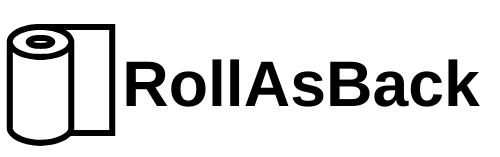

#  
# Python Web Backend Framework 
[](https://opensource.org/licenses/MIT)
[](https://github.com/CodeWikiOrg/RollAsBack/releases)
[](https://pypi.org/project/rollasback/)
[](https://pypi.org/project/rollasback/)
[](https://github.com/CodeWikiOrg/RollAsBack)


## Description

RollAsBack is an innovative web backend framework meticulously crafted in Python. Engineered to offer a seamless and adaptable solution for constructing web applications, this framework empowers developers to define routes and proficiently manage HTTP requests.

At the heart of RollAsBack lies a commitment to simplicity and flexibility. The framework's design philosophy centers around facilitating the development process, allowing developers to focus on building robust web applications without the unnecessary complexities often associated with backend development.


## Usage

RollAsBack provides a simple way to define and handle routes in your web application. It includes basic functionality for handling HTTP requests and responses.

## Features

- **Route Handling:** Define routes using the `@endpoint` decorator.
- **Request Parsing:** Parse HTTP requests and extract relevant information.
- **Response Generation:** Generate HTTP responses with ease.
- **Logging:** Log important events and messages.

## Example

```python
from rollasback.app import RollAsBack, HttpResponse, RESPONSEMEMETYPES

app = RollAsBack("MyApp")

@app.endpoint("/hello")
def hello(request):
    return HttpResponse("Hello, World!", status=200, mimetype=RESPONSEMEMETYPES.text_plain)

if __name__ == "__main__":
    app.start_server("127.0.0.1", 8000)
```

In this example, a simple "Hello, World!" route is defined. When the server is started, it listens on `127.0.0.1:8000` for incoming requests.

## Disclaimer

This software is provided "as is" without warranty of any kind, express or implied, including but not limited to the warranties of merchantability, fitness for a particular purpose, and noninfringement. In no event shall the authors or copyright holders be liable for any claim, damages, or other liability, whether in an action of contract, tort, or otherwise, arising from, out of, or in connection with the software or the use or other dealings in the software.


## License

This project is licensed under the MIT License - see the [LICENSE](LICENSE) file for details.

---

*Note: Adjust the file structure and import paths according to your project setup.*

Feel free to extend RollAsBack based on your application's requirements. For more details on how to use and customize the framework, refer to the source code and additional documentation.


**Happy coding with RollAsBack!**